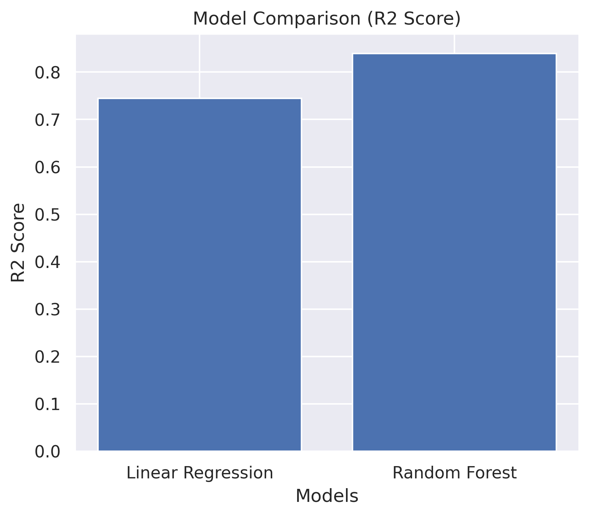
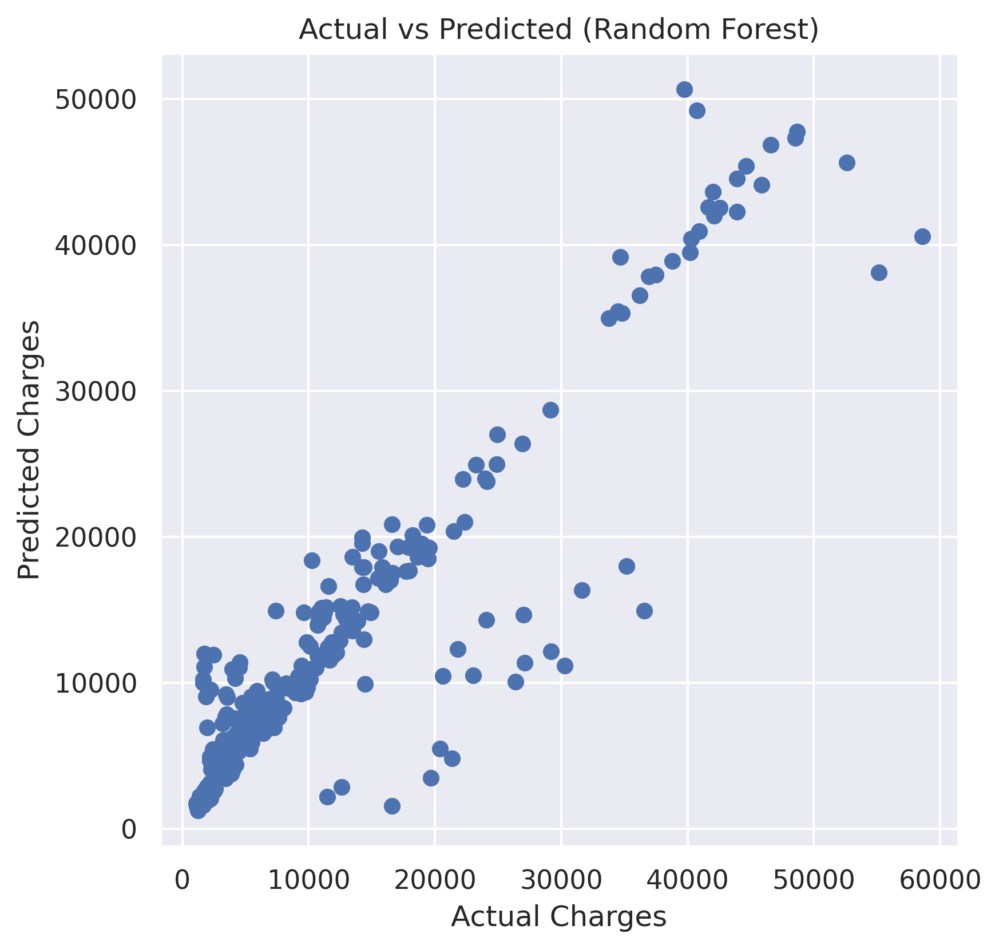
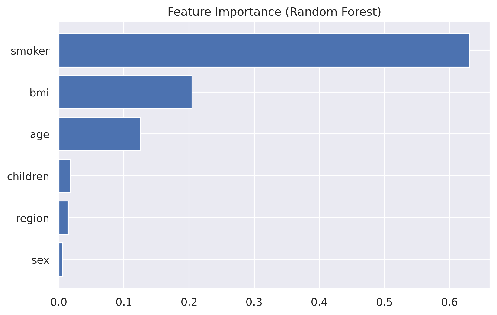

# 🏥 Medical Insurance Cost Prediction using Machine Learning

> An end-to-end Machine Learning regression project for predicting healthcare insurance charges using demographic and lifestyle features.

---


**Author:** Lalit Vijay  
**Technologies:** Python, Scikit-learn, Pandas, NumPy, Matplotlib, Seaborn  


---

## 📌 Project Overview

This project builds predictive Machine Learning models to estimate medical insurance charges based on:

- Age  
- Gender  
- BMI  
- Number of children  
- Smoking status  
- Region  

The project demonstrates the complete ML workflow including:

- Exploratory Data Analysis (EDA)
- Data Preprocessing
- Feature Encoding
- Model Building
- Model Comparison
- Performance Visualization
- Model Export (.pkl)

---

## 🎯 Problem Statement

To develop a regression-based predictive system that estimates medical insurance costs using supervised machine learning techniques and compare multiple models to determine the best performer.

---

## 📊 Dataset Features

| Feature | Description |
|----------|------------|
| Age | Age of the individual |
| Sex | Gender (Male/Female) |
| BMI | Body Mass Index |
| Children | Number of dependents |
| Smoker | Smoking status |
| Region | Residential region |
| Charges | Medical insurance cost (Target Variable) |

---

## 🤖 Models Implemented

- Linear Regression  
- Random Forest Regressor  

---

## 📈 Model Performance

| Model | R² Score |
|--------|----------|
| Linear Regression | 0.744 |
| Random Forest | 0.835 |

Random Forest outperformed Linear Regression, indicating the presence of non-linear relationships in the dataset.

---

## 📊 Key Insights

- Smoking status has the highest impact on insurance charges.
- BMI and Age significantly influence medical costs.
- Random Forest captures complex relationships better than Linear Regression.

---

## 📷 Visualizations

### Model Comparison


### Actual vs Predicted (Random Forest)


### Feature Importance


## 📂 Project Structure

```yaml
Medical-Insurance-Cost-Prediction-ML:
  images:
    - model_comparison.png
    - actual_vs_predicted.png
    - feature_importance.png

  files:
    - Medical_Insurance_Cost_Prediction.ipynb
    - insurance.csv
    - insurance_model.pkl
    - requirements.txt
    - README.md
    - LICENSE
```

## 🚀 How to Run

### 1️⃣ Clone the repository

```bash
git clone https://github.com/vijaylalit-PA/Medical-Insurance-Cost-Prediction-ML.git
```

### 2️⃣ Navigate into the project folder

```bash
cd Medical-Insurance-Cost-Prediction-ML
```

### 3️⃣ Install dependencies

```bash
pip install -r requirements.txt
```

### 4️⃣ Run the notebook

Open and execute:

```
Medical_Insurance_Cost_Prediction.ipynb
```

---

## 💾 Model Export

The trained model is saved as:

```
insurance_model.pkl
```

This allows reuse or deployment without retraining.

---

## 📌 Conclusion

- Machine learning can effectively predict healthcare insurance costs.
- Model comparison is important in regression tasks.
- Random Forest outperformed Linear Regression.
- Smoking status has the strongest impact on insurance charges.
- Non-linear relationships exist in the dataset.

This project demonstrates a complete end-to-end ML workflow including EDA, preprocessing, modeling, evaluation, and model export.
